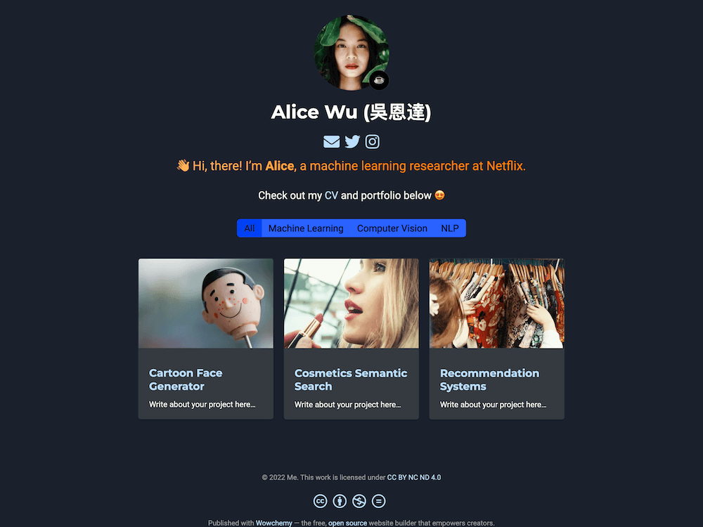

이 과제의 핵심은 Hugo라는 정적 사이트 생성기를 사용하여 HTML, CSS, JavaScript를 사용하지 않고 포트폴리오 웹사이트를 구축하는 것입니다. Hugo는 기본적으로 Markdown 파일을 사용하고, 이미 준비된 Hugo 템플릿과 테마를 활용하여 사이트를 자동으로 생성합니다. 이 과정에서 Hugo의 기능과 설정만을 이용하여 사이트를 구성해야 한다는 점이 중요한데요, 여기서 헷갈릴 수 있는 몇 가지 핵심 포인트를 설명하겠습니다.

주요 요구사항 설명
HTML, CSS, JavaScript 사용 금지:

Hugo Demo Template과 관련 없는 HTML, CSS, JavaScript 코드를 사용하면 감점된다는 내용입니다. 대신 Hugo의 Markdown 파일과 기본 제공 템플릿만을 사용해 웹사이트를 만들어야 합니다.
기본 템플릿에서 제공하는 CSS 파일을 약간 수정할 수는 있습니다(예: 버튼의 호버 이벤트).
GitHub Pages를 통해 배포:

Hugo를 사용해 만든 웹사이트를 GitHub Pages를 통해 자동으로 빌드 및 배포하는 것이 목표입니다.
GitHub Actions를 사용하여 자동 빌드 및 배포가 되도록 설정해야 하며, 결과물에 Hugo 사이트가 제대로 표시되지 않으면 감점됩니다.
다국어 지원:

웹사이트는 최소 2개 언어(한국어 포함)를 지원해야 합니다. Hugo에서 제공하는 다국어 지원 기능을 설정해두어야 합니다.
포트폴리오 사이트의 구조:

이름, 사진, 소속, 전공, 경력, 프로젝트 소개 등의 내용을 포함한 자기소개 페이지를 잘 구성해야 하며, 각 메뉴마다 최소 2개 이상의 서브 메뉴를 구성해야 합니다.
특정 요구사항:

다크모드/라이트모드 지원: Hugo의 테마에서 제공하는 다크모드/라이트모드 전환 기능을 설정해야 합니다.
카드 구성: 메인 페이지에 최소 9개의 카드(3개의 프로젝트 * 3개의 카테고리)를 보여주어야 합니다.
소셜 미디어 연동: GitHub, LinkedIn 등 소셜 미디어 아이콘을 포함하고, 이들을 통해 연동되도록 설정해야 합니다.
이미지 슬라이더: 메인 페이지에 이미지 슬라이더를 포함해야 하며, 이는 Hugo의 기능을 통해 구현할 수 있습니다.
메뉴 구성: 5개 이상의 메뉴 탭을 구성해야 합니다(예: Home, About, Projects, Contact 등).
Hugo를 이용한 해결 방안
Hugo 테마 사용:

Hugo Theme을 선택하고, 그 안에 제공되는 기본 기능을 활용해 HTML/CSS 없이 웹사이트를 구축할 수 있습니다.
테마 내에서 제공하는 요소들을 수정하거나 활용해 자기소개 페이지와 프로젝트 페이지 등을 구성할 수 있습니다.
Markdown 파일로 웹사이트 구성:

content 폴더 내에 .md 파일을 만들어 페이지들을 구성합니다. 예를 들어, content/about.md 파일을 만들어 자기소개 페이지를 작성하고, content/projects.md 파일을 만들어 프로젝트 목록을 작성할 수 있습니다.
다국어 지원:

Hugo의 config.toml 또는 config.yaml 파일에서 다국어 설정을 추가하여, 한국어와 영어 등 두 가지 언어를 지원할 수 있게 설정합니다.
자동 배포:

GitHub Actions를 설정하여 GitHub에 커밋할 때마다 Hugo가 자동으로 빌드되고 GitHub Pages에 배포되도록 해야 합니다.
페이지 구성:

다국어 설정, 다크모드/라이트모드 전환, 카드 뷰 등을 테마의 기능으로 설정하거나 수정하여 구현할 수 있습니다.
버튼 및 페이지 링크 구현
HTML 없이도 Markdown 문법을 사용하여 버튼처럼 보이는 링크를 만들 수 있습니다.
Hugo는 기본적으로 Markdown 파일만으로 페이지를 생성하며, 링크나 페이지 이동 기능도 Markdown을 통해 구현할 수 있습니다.
markdown
Copy code
# Welcome to my portfolio!

[About Me](/about)  
[My Projects](/projects)
이와 같이 Markdown 문법으로 페이지를 구성하면 Hugo가 이를 자동으로 빌드해 웹사이트로 만들어줍니다.

정리
HTML, CSS, JavaScript를 사용하지 않고 Hugo의 기본 기능만을 사용하여 사이트를 구성해야 합니다.
다국어 지원, 다크모드/라이트모드와 같은 기능들은 기본적으로 Hugo 테마에서 제공하는 기능을 사용하거나 간단히 설정할 수 있습니다.
GitHub Pages를 통해 자동으로 빌드 및 배포가 되도록 설정하고, GitHub Actions을 사용하여 이를 자동화할 수 있어야 합니다.
이 과제는 Hugo의 기능을 최대한 활용하고, HTML이나 CSS를 직접 작성하지 않으며도 Markdown 파일만으로 정적 웹사이트를 구축하는 것이 목표입니다.

# [Hugo Portfolio Theme](https://github.com/wowchemy/starter-hugo-portfolio-theme)

The **Hugo Portfolio Template** empowers you to easily create a portfolio website. Make it your own by choosing a color theme and grid layout!

️**Trusted by 250,000+ researchers, educators, and students.** Highly customizable via the integrated **no-code, widget-based Wowchemy page builder**, making every site truly personalized ⭐⭐⭐⭐⭐

  

[Check out the latest demo](https://hugo-portfolio-theme.netlify.app/) of what you'll get in less than 10 minutes, or [view the showcase](https://hugoblox.com/creators/).

The integrated [**Wowchemy**](https://hugoblox.com) website builder and CMS makes it easy to create a beautiful website for free. Edit your site in the CMS (or your favorite editor), generate it with [Hugo](https://github.com/gohugoio/hugo), and deploy with GitHub or Netlify. Customize anything on your site with widgets, light/dark themes, and language packs.

- 👉 [**Get Started**](https://hugoblox.com/hugo-themes/)
- 📚 [View the **documentation**](https://docs.hugoblox.com/)
- 💬 [Chat with the **Wowchemy research community**](https://discord.gg/z8wNYzb) or [**Hugo community**](https://discourse.gohugo.io)
- ⬇️ **Automatically import citations from BibTeX** with the [Hugo Academic CLI](https://github.com/GetRD/academic-file-converter)
- 🐦 Share your new site with the community: [@wowchemy](https://twitter.com/wowchemy) [@GeorgeCushen](https://twitter.com/GeorgeCushen) [#MadeWithWowchemy](https://twitter.com/search?q=%23MadeWithWowchemy&src=typed_query)
- 🗳 [Take the survey and help us improve #OpenSource](https://forms.gle/NioD9VhUg7PNmdCAA)
- 🚀 [Contribute improvements](https://github.com/HugoBlox/hugo-blox-builder/blob/main/CONTRIBUTING.md) or [suggest improvements](https://github.com/HugoBlox/hugo-blox-builder/issues)
- ⬆️ **Updating?** View the [Update Guide](https://docs.hugoblox.com/hugo-tutorials/update/) and [Release Notes](https://github.com/HugoBlox/hugo-blox-builder/releases)

## We ask you, humbly, to support this open source movement

Today we ask you to defend the open source independence of the Wowchemy website builder and themes 🐧

We're an open source movement that depends on your support to stay online and thriving, but 99.9% of our creators don't give; they simply look the other way.

### [❤️ Click here to become a GitHub Sponsor, unlocking awesome perks such as _exclusive academic templates and widgets_](https://github.com/sponsors/gcushen)
